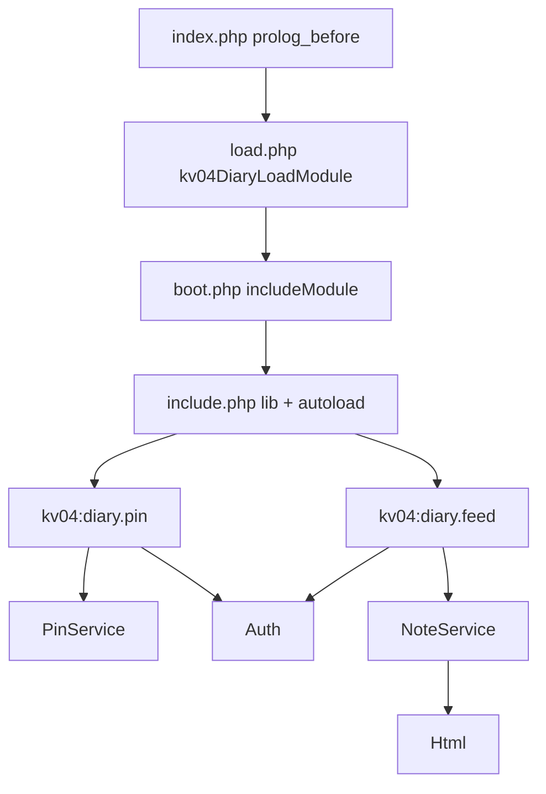

# Онбординг агента — kv04.ru

Читать **до** правок кода. Правила кодирования — `.cursor/rules/`. История решений — `docs/specs/`. Спеки и память Serena **не править**, пока пользователь явно не попросит.

## Что это

Bitrix-сайт `kv04.ru` (`D:\kv04_ru`, document root `public_html/`). На главной — **личный микро-дневник по PIN**, UI как Telegram, без `$USER`. Кастом только в `public_html/local/` и `index.php`. Цель — модули `kv04.*` на [Маркетплейс](https://marketplace.1c-bitrix.ru/).

Не трогать: `public_html/bitrix/**`, `D:\EDT_dev`.

## Первые 5 минут

1. `.cursor/rules/kv04-core.mdc` (alwaysApply)
2. Этот файл
3. `docs/specs/0001-homepage-private-diary.md` — контракт продукта
4. API Bitrix — MCP `project-0-kv04_ru-bitrix`, не grep ядра

## Архитектура

Гость → PIN-пад. После входа → лента. `Installer::ensure()` создаёт HL и инфоблок идемпотентно.

## Карта файлов

| Путь | Зачем |
|------|--------|
| `public_html/index.php` | Оболочка дневника, без шаблона магазина |
| `local/modules/kv04.diary/load.php` | Точка входа `kv04DiaryLoadModule()` |
| `local/modules/kv04.diary/boot.php` | register + `includeModule`, затем всегда `include.php` |
| `local/modules/kv04.diary/include.php` | require lib, autoload `null` + `/local/` пути |
| `local/modules/kv04.diary/lib/installer.php` | HL + iblock + pepper |
| `local/modules/kv04.diary/lib/auth.php` | Cookie `KV04_DIARY`, TTL 10 ч |
| `local/modules/kv04.diary/lib/pinservice.php` | Почта как идентичность, HMAC пина |
| `local/modules/kv04.diary/lib/attemptlimiter.php` | Лестница блокировок, своя таблица |
| `local/modules/kv04.diary/lib/bookservice.php` | Дневники владельца, до 50 |
| `local/modules/kv04.diary/lib/noteservice.php` | CRUD заметок, MEDIA, корзина |
| `local/modules/kv04.diary/lib/html.php` | sanitize, изоляция `<pre>` |
| `local/modules/kv04.diary/assets/diary-theme.css` | Общая тёмная тема |
| `local/modules/kv04.diary/assets/highlight/` | highlight.js 11.9.0, свой, не cdnjs |
| `local/components/kv04/diary.pin/` | Вход / создание |
| `local/components/kv04/diary.feed/` | Лента, AJAX |
| `local/php_interface/init.php` | Подключает `load.php` |

## Данные

- HL `Kv04DiaryKey` / таблица `kv04_diary_keys`: `UF_PIN_HASH`, `UF_OWNER_ID`, `UF_EMAIL`, `UF_FAILS`, `UF_LOCKED_UNTIL`
- Свои таблицы: `kv04_diary_attempts` (лестница блокировок), `kv04_diary_books` (дневники), `kv04_diary_trash` (обрывки в корзине)
- Инфоблок тип `kv04`, код `diary`: `OWNER`, `BOOK`, `MEDIA` (файл, multiple), `DELETED_AT`. Удалённое — `ACTIVE = N`
- Option модуля `kv04.diary`: `pepper`, `hlblock_id`, `iblock_id`, `schema_version` (сейчас 6)
- Cookie: `KV04_DIARY` (сессия, 10 ч), `KV04_DIARY_DEVICE` (привязка браузера, год)

POST feed: `add`, `edit`, `delete`, `restore`, `delete_block`, `restore_fragment`, `attach`, `detach_media`, `trash`, `book_create`, `book_rename`, `book_delete`, `book_switch`, `attach_email`, `logout`. Pin: вход без action, `create`, `forget_device`, `logout`. Всегда `check_bitrix_sessid()`.

## Deploy и проверка

- PhpStorm: сервер `kv04`, `autoUpload=Always` — правка может сразу уйти на прод.
- SSH: `infopolura@77.222.40.47`, сайт `/home/i/infopolura/kv04_ru/public_html/`
- Проверка: `curl -sS -o NUL -w "%{http_code}" https://kv04.ru/` — ожидается 200, без fatal `/bitrix/modules/kv04.diary/`
- «Нет связи» в UI = часто HTTP 500, HTML вместо JSON

## MCP

| Когда | Чем |
|-------|-----|
| Сигнатуры Bitrix, docs | MCP `project-0-kv04_ru-bitrix` (`searchDocs`, live API) |
| Свой код в `local/` | Serena / обычные файловые тулы |
| Внешние библиотеки | context7, не Bitrix MCP |

## Нельзя

- Копировать модуль в `/bitrix/modules/`
- Править ядро и `D:\EDT_dev`
- Печатать пароли из `dbconn.php` / `.settings.php`
- Обновлять спеки и `.serena/memories/` без команды пользователя

## Известные ловушки

Подробно: `.serena/memories/known_caveats.md`. Кратко: сайту нужен **PHP 8.1+** — ядро содержит `enum`, на 8.0 весь сайт отдаёт 500; autoload в `/bitrix/` без `include.php`; PHP 8.4 и `SetPropertyValuesEx` для MEDIA; `strip_tags`/`on\w+=` ломают PHP-код в заметках; `epilog_after.php` не подключать.
